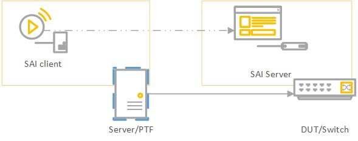

# Warm reboot Test Plan


## Overriew
The purpose of those tests is to verify the functionality of the warm reboot scenarios from SAI layer. Including the behavior verification, switch attribute and configuration, and packet transfer during warm boot.

## Scope
Those tests are targeted on verify the warm reboot from sai layer. With this purpose, those tests will focus on the SAI interface and the switch data which can be manipulate and check from SAI interfaces.

Sai tests will not independent from SONiC components, this will ensure the quality from fundmental layer, and shift tests to the left side of the spectrum.

## Test bed
---
Those test will be run on the test bed structure as below, the components are:
* PTF - running in a server which can connect to the target DUT
* SAI server - running on a dut
   
*p.s. cause the sai testing will not depends on any sonic components, then there will be no specifical topology(T0 T1 T2) for testing.*

## Test Structure
---

Test structure the chart above, components are:
*PTF container - run test cases, and use a RPC client to invoke the SAI interfaces on DUT
*SAI Server container - run inside DUT/switch, which exposes the SAI SDK APIs from the libsai
*SAI-Qualify - Test controller, which is used to deploy and control the test running, meanwhile, manipulate the DUT on warm reboot.

## Test Methodology
---
Cause the warm reboot testing needs to reboot the dut, we need some approach to control and make differnt verification in the whole reboot process the

* For warmboot functionality verification, needs to control the dut with RPC APIs to make different configuration for shutdown and startup
* For switch behivor during warmboot, manipulate the Reboot stage by invoke the sai interface manually but not depends on the system services.
* Contol the warmboot process for checking the data/packet/status/attribute in different stage of the reboot, including before/in-middle/after of the warm reboot.
*  Validation will be devided into two kinds, switch status check (attribute and configurations), and switch behivor check(packet delivering). The packet delivering verification will be seperated into different features' tests.

### Manipulate warm boot process

1. Removal the system services during reboot, like swss, syncd, lldp, teamd etc. Then there will be no sonic components in the testing environment.
2. Start sai server docker, use saiserver to setup the shutdown mode and configuration trigger a restart.
   ```
   SAI_START_TYPE_WARM_BOOT
   SAI_WARM_BOOT_WRITE_FILE=/var/warmboot/sai-warmboot.bin
   ```
3. Stimulate a system restart
   ```
   kexec
   ```
4. Start sai server docker, use saiserver to setup the startup mode
   ```
   SAI_START_TYPE_WARM_BOOT
   SAI_WARM_BOOT_READ_FILE: /var/warmboot/sai-warmboot.bin
   ```

## Switch configuration Test cases
---
### Case 1 - Sanity test for warm boot - happy path
#### Test objective
Test the basic warm boot function, read and write file from the configured dump file.
#### Test steps
1. Start saiserver and switch
2. Config vlan port and fib
3. Packet forwarding check
4. Shutdown switch in warm mode
5. Packet forwarding check, result same as step 3
6. Start switch in warm mode
7. Packet forwarding check, result same as step 3

### Case 2 - Sanity test for warm boot - failed path, ?expected behivor?
#### Test objective
Test the basic warm boot function, error happened when cannot read configured dump file.
#### Test steps
1. Start saiserver and switch
2. Config vlan port and fib
3. Packet forwarding check
4. Shutdown switch in warm mode

### Case 3 - switch OIDs consistence

### Case 4 - IPv4 entry

### Case 5 - IPv6 entry

### Case 6 - IPv4 Next hop entry

### Case 7 - IPv6 Next hop entry

### Case 8 - IPv4 Neighbor entry

### Case 9 - IPv6 Neighbor entry

### Case 10 - Next hop group entry

### Case 11 - Next hop group  member entry

### Case 12 - Fdb entry

### Case 13 - ACL table

### Case 14 - Read only attribute midifications

### Case 14 - Vlan state counter

### Case 15 - RIF status counter

### Case 15 - SNAT entry

### Case 16 - DNAT entry

### Case 17 - VXLAN 

## Switch features Test cases
### Case 1 - vlan feature